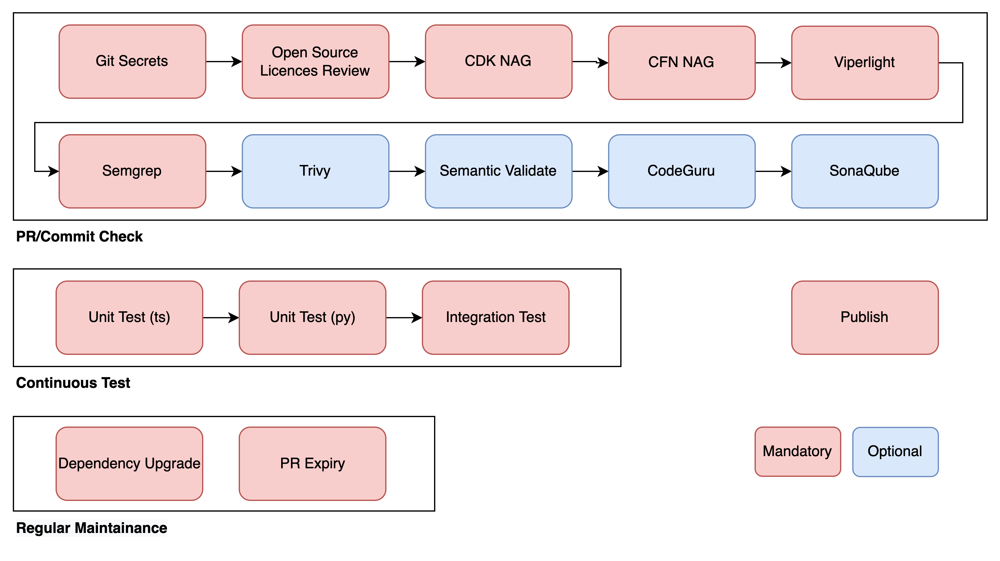

# WorkflowTemplate
This is a template for a workflow. It is meant to be used as a starting point for a new workflow.

## Overall Workflow
The workflow is composed of 5 stages: build, test, maintainance, publish, cleanup. Each stage is executed by serveral scripts. Those scripts are executed in the order of build, test, maintainance, publish, cleanup or on demand.

## Usage
1. Create a new repository from this template
2. Copy the files from the `workflow` directory to the root of your repository
3. Execute the `workflow` script to start the workflow

## Build Stage
The build stage is used to build the project. It is executed by the `build` script.

## Test Stage
The test stage is used to test the project by usage of UT/ST/Acceptance tests. It is executed by the `test*` script.

## Maintain Stage
The maintain stage is used for maintainance tasks, including routine dependency update, PR lint, commit Lint. It is executed by the `depUpgrade`, `prLint`, `commitLint`, `issueExpiry` script.

## Publish Stage
The deploy stage is used to deploy the project. It is executed by the `publish` script.

## Cleanup Stage
The cleanup stage is used to clean up the project. It is executed by the `cleanup` script.

## Other Reference
- https://docs.github.com/en/actions/using-workflows/
- https://github.com/actions/checkout
- https://github.com/aws-actions/configure-aws-credentials
- https://github.com/aws-actions/codeguru-reviewer
- https://github.com/marketplace/actions/aws-cdk-github-actions
- https://github.com/postmanlabs/newman/tree/develop/examples
