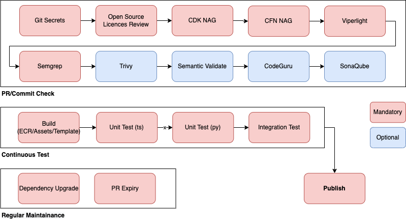

# WorkflowTemplate
This is a template for a workflow. It is meant to be used as a starting point for a new workflow.

## Overall Workflow
The workflow is based on GitHub Actions that triggered by the actions including PR/Commit, Manual, Schedule, etc. it is composed of several stages, including PR/Commit Check, Test, Maintainance, Publish, etc. with template files defined in the `workflow` directory. The sample folder includes a simple CDK project including test cases that used for the demonstration of overall workflow functionality.

## Usage
1. Create a new repository from this template
2. Copy the files from the `workflow` directory to the root of your repository
3. Execute the `workflow` script to start the workflow

There are typical stage for a workflow. You can add or remove stages as you need. The scripts are executed in the order of PR/Commit Check, Test (UT/ST/IT), Maintainance, Publish or on demand.

## PR/Commit Check
The PR/Commit Check stage is executed when a PR is created or a commit is pushed to the repository, to gurarantee the code quality according to the rules defined in the scripts.

## Test
The Test stage can be execute manually or automatically. It is used to test the actual deployed Amplify/REST API by using Postman/Newman. The Unit Test scripts are defined in the `test` directory while the Integration Test scripts are defined in the postman collection.

## Maintainance
The Maintainance stage mainly used to update the dependencies of the project for security reasons, and operate the PR lifecycle.

## Publish
The Publish stage is used to publish the CloudFormation template to S3 bucket and generate implementation guide for the solution with use of MKDocs.

## Other Reference
- https://docs.github.com/en/actions/using-workflows/
- https://github.com/actions/checkout
- https://github.com/aws-actions/configure-aws-credentials
- https://github.com/aws-actions/codeguru-reviewer
- https://github.com/marketplace/actions/aws-cdk-github-actions
- https://github.com/postmanlabs/newman/tree/develop/examples
